# Retail Customer Analytics — Dataflow Architecture

> **Ground Truth Reference** — This diagram represents the canonical dataflow from raw input columns through shared modules to final insights. All implementations (CLI, Streamlit, tests) must follow this flow.

```mermaid
flowchart TD
    %% ============================================================
    %% INPUT LAYER
    %% ============================================================
    subgraph INPUT["INPUT LAYER"]
        RAW["Raw CSV/Parquet<br/>(customer_id, transaction_date, transaction_id,<br/> product_id, product_description, department,<br/> category, price, quantity)"]
        VALIDATE["ingestion.load_lines()<br/>+ parse_dates()<br/>+ structural_checks()"]
        CLEAN["ingestion.clean_lines()<br/>(drop_exact_duplicates,<br/> exclude_zero_quantity,<br/> exclude_negative_prices)"]
        NORMALIZE["ingestion.prepare_transaction_frame()<br/>→ Normalized DataFrame<br/>+ transaction_day, line_revenue,<br/>  revenue columns"]
    end

    %% ============================================================
    %% SHARED CANONICAL MODULES
    %% ============================================================
    subgraph SHARED["SHARED CANONICAL MODULES (src/retail_customer_analytics)"]
        subgraph EVENTS["events.py — Canonical Event Construction"]
            EVT_CONFIG["EventConfig<br/>(basket_grain, transaction_key_mode)"]
            BUILD_TRIPS["build_purchase_events()<br/>→ trips: customer_id, transaction_day,<br/>  trip_value, n_lines, n_products, n_units"]
            BUILD_BASKETS["build_baskets()<br/>→ baskets: customer_id, basket_key, items[]"]
            MATCH_RETURNS["match_returns()<br/>→ matched_returns + diagnostics"]
            PRICE_INDEX["add_price_index()<br/>→ reference_price, price_index, promo_like"]
        end

        subgraph AFFINITY["affinity.py — Bounded Basket Affinity"]
            AFF_CONFIG["AffinityConfig<br/>(max_candidates, max_baskets,<br/> max_items_per_basket, max_pair_operations,<br/> min_customers, random_seed)"]
            ANALYZE_AFF["analyze_affinity()<br/>→ AffinityResult:<br/>  - associations (pairs)<br/>  - transitions (next-trip)<br/>  - diagnostics (status, budgets, coverage)"]
            ANALYZE_APP["analyze_affinity_from_app()<br/>→ Streamlit-compatible dict"]
        end

        subgraph FEATURES["features.py — Canonical Feature Builder"]
            FEAT_CONFIG["build_customer_snapshot()<br/>(windows_days, recent_window_days)"]
            CORE["_core_customer_features()<br/>→ RFM, cadence, recency, regularity"]
            WINDOWS["_window_features()<br/>→ rolling revenue/trips, recent-vs-prior"]
            BREADTH["_breadth_features()<br/>→ distinct products/cats/depts, HHI"]
            PROMO["_promo_features()<br/>→ promo_spend_share, price_index stats"]
            CAT_AFF["_category_affinity_features()<br/>→ category spend shares, entropy"]
            TRENDS["_trend_features()<br/>→ monthly slope, CV, active months<br/>  (includes zero-activity months)"]
            BASKET_FEAT["_basket_composition_features()<br/>→ mean products/cats/units per trip"]
            RETURNS["_return_features()<br/>→ return_value, unmatched_return_value"]
            VALIDATE_FEAT["validate_feature_contract()<br/>→ REQUIRED_FEATURES + OPTIONAL_FEATURES"]
        end

        INGESTION["ingestion.py<br/>(parse_dates, load_lines, clean_lines,<br/> structural_checks, prepare_transaction_frame,<br/> fmt_currency, fmt_number, fmt_pct)"]
    end

    %% ============================================================
    %% ORCHESTRATION ENTRY POINTS
    %% ============================================================
    subgraph ENTRY["ORCHESTRATION ENTRY POINTS"]
        subgraph CLI["retail_customer_analysis.py — CLI Pipeline"]
            CLI_ARGS["argparse.Namespace<br/>(horizon_days, frequency_grain,<br/> transaction_key_mode, windows_days,<br/> rolling_origins, ...)"]
            CLI_RUN["run_analysis()<br/>→ Orchestrates full pipeline"]
            CLI_TRIPS["build_trips()<br/>  → events.build_purchase_events()"]
            CLI_FEATS["build_customer_snapshot()<br/>  → features.build_customer_snapshot()"]
            CLI_SCORE["score_customers()<br/>  (BG/NBD + Gamma-Gamma)"]
            CLI_RFM["assign_rfm()"]
            CLI_CLUSTER["cluster_customers()<br/>  (K-means + stability)"]
            CLI_AFF["basket_affinity()<br/>  → affinity.analyze_affinity()"]
            CLI_SURV["repeat_survival() + cohort_retention()"]
            CLI_VALID["holdout_validation() /<br/> rolling_origin_validation()"]
            CLI_WRITE["write_table() + write_report()"]
        end

        subgraph APP["app.py — Streamlit Application"]
            APP_UPLOAD["st.file_uploader<br/>→ prepare_transaction_frame()"]
            APP_PERIOD["get_period_context()<br/>→ period_params"]
            APP_FEATS["build_customer_features()<br/>  → features.build_customer_snapshot()"]
            APP_AFF["_compute_basket_analysis()<br/>  → affinity.analyze_affinity_from_app()"]
            APP_ACTIONS["Action generation from features"]
            APP_CHARTS["insight_engine.py charts<br/>+ matplotlib helpers"]
            APP_TABS["Tab renderers (00-15)"]
        end

        subgraph INSIGHT["insight_engine.py — Reporting Engine"]
            INS_LOAD["load_results()<br/>→ reads all CSV artifacts"]
            INS_CHARTS["chart_rules()<br/>→ generates all matplotlib figures"]
            INS_KPIS["generate_kpis()<br/>→ KPI summary tables"]
            INS_HTML["generate_html_report()<br/>→ standalone HTML dashboard"]
        end
    end

    %% ============================================================
    %% ANALYTICAL OUTPUTS
    %% ============================================================
    subgraph OUTPUTS["ANALYTICAL OUTPUTS & ARTIFACTS"]
        subgraph CUSTOMER["Customer-Level Analytics"]
            CUST_FEATS["customer_features.csv<br/>(71+ columns per customer)"]
            CUST_SCORED["Scored customers<br/>(P(alive), expected_trips,<br/> expected_revenue, prediction_source)"]
            CUST_RFM["RFM segments<br/>(rfm_segment, rfm_score)"]
            CUST_CLUSTER["Cluster assignments<br/>(cluster_id, cluster_label)"]
        end

        subgraph PRODUCT["Product/Category Analytics"]
            PROD_SUM["product_summary.csv<br/>(revenue, orders, units, repeat rate)"]
            CAT_SUM["category_summary.csv"]
            DEPT_SUM["department_summary.csv"]
            BASKET_AFF["basket_affinity.csv<br/>(support, confidence, lift, odds_ratio,<br/> q_value_bh, persistence)"]
            NEXT_TRIP["next_trip_affinity.csv<br/>(transition probabilities)"]
        end

        subgraph TEMPORAL["Temporal & Validation"]
            HOLDOUT["holdout_metrics.csv<br/>(MAE, RMSE, WAPE, Spearman, AUC)"]
            CALIB["holdout_calibration.csv<br/>(decile calibration)"]
            ROLLING["Rolling-origin metrics<br/>(per-origin + aggregate)"]
            SURVIVAL["repeat_survival.csv<br/>(Kaplan-Meier + CI)"]
            COHORT["cohort_retention_new_customers.csv"]
            INTERPURCH["interpurchase_intervals.csv"]
        end

        subgraph SEGMENT["Segmentation & Diagnostics"]
            CLUSTER_DIAG["cluster_diagnostics.csv<br/>(silhouette, ARI, stability)"]
            CLUSTER_PROF["cluster_profiles.csv<br/>(medians, totals per cluster)"]
            RFM_CLUSTER["rfm_cluster_comparison.csv"]
            CLUSTER_STAB["cluster_stability.csv<br/>(cross-snapshot ARI)"]
        end

        subgraph QUALITY["Data Quality & Metadata"]
            DQ_JSON["data_quality.json<br/>(issue_counts, exclusions, accounting)"]
            DQ_ISSUES["data_quality_issues.csv"]
            RUN_META["run_metadata.json<br/>(config, seed, versions, schemas)"]
            MODEL_PARAMS["model_parameters.csv<br/>(BG/NBD, Gamma-Gamma params)"]
            REPORT_MD["analysis_report.md<br/>(human-readable summary)"]
            REPORT_HTML["analysis_report.html<br/>(interactive dashboard)"]
        end
    end

    %% ============================================================
    %% DATA FLOW CONNECTIONS
    %% ============================================================
    RAW --> VALIDATE --> CLEAN --> NORMALIZE

    NORMALIZE --> EVT_CONFIG
    EVT_CONFIG --> BUILD_TRIPS
    EVT_CONFIG --> BUILD_BASKETS
    NORMALIZE --> MATCH_RETURNS
    NORMALIZE --> PRICE_INDEX

    NORMALIZE --> AFF_CONFIG
    AFF_CONFIG --> ANALYZE_AFF
    AFF_CONFIG --> ANALYZE_APP
    BUILD_BASKETS -.->|used internally| ANALYZE_AFF

    NORMALIZE --> FEAT_CONFIG
    BUILD_TRIPS --> FEAT_CONFIG
    FEAT_CONFIG --> CORE
    FEAT_CONFIG --> WINDOWS
    FEAT_CONFIG --> BREADTH
    FEAT_CONFIG --> PROMO
    FEAT_CONFIG --> CAT_AFF
    FEAT_CONFIG --> TRENDS
    FEAT_CONFIG --> BASKET_FEAT
    MATCH_RETURNS --> RETURNS
    RETURNS --> FEAT_CONFIG
    CORE --> VALIDATE_FEAT
    WINDOWS --> VALIDATE_FEAT
    BREADTH --> VALIDATE_FEAT
    PROMO --> VALIDATE_FEAT
    CAT_AFF --> VALIDATE_FEAT
    TRENDS --> VALIDATE_FEAT
    BASKET_FEAT --> VALIDATE_FEAT
    RETURNS --> VALIDATE_FEAT

    NORMALIZE --> CLI_ARGS
    CLI_ARGS --> CLI_RUN
    CLI_RUN --> CLI_TRIPS
    CLI_RUN --> CLI_FEATS
    CLI_FEATS --> CLI_SCORE
    CLI_SCORE --> CLI_RFM
    CLI_SCORE --> CLI_CLUSTER
    CLI_RUN --> CLI_AFF
    CLI_RUN --> CLI_SURV
    CLI_RUN --> CLI_VALID
    CLI_RUN --> CLI_WRITE
    MATCH_RETURNS -.-> CLI_RUN
    PRICE_INDEX -.-> CLI_RUN

    APP_UPLOAD --> NORMALIZE
    NORMALIZE --> APP_PERIOD
    APP_PERIOD --> APP_FEATS
    APP_PERIOD --> APP_AFF
    APP_FEATS --> APP_ACTIONS
    APP_AFF --> APP_CHARTS
    APP_FEATS --> APP_CHARTS
    APP_ACTIONS --> APP_TABS
    APP_CHARTS --> APP_TABS

    CUST_FEATS -.-> INS_LOAD
    CUST_SCORED -.-> INS_LOAD
    PROD_SUM -.-> INS_LOAD
    BASKET_AFF -.-> INS_LOAD
    HOLDOUT -.-> INS_LOAD
    SURVIVAL -.-> INS_LOAD
    COHORT -.-> INS_LOAD
    CLUSTER_DIAG -.-> INS_LOAD
    DQ_JSON -.-> INS_LOAD
    INS_LOAD --> INS_CHARTS
    INS_LOAD --> INS_KPIS
    INS_CHARTS --> INS_HTML
    INS_KPIS --> INS_HTML

    CLI_WRITE --> CUST_FEATS
    CLI_WRITE --> CUST_SCORED
    CLI_WRITE --> CUST_RFM
    CLI_WRITE --> CUST_CLUSTER
    CLI_WRITE --> PROD_SUM
    CLI_WRITE --> CAT_SUM
    CLI_WRITE --> DEPT_SUM
    CLI_WRITE --> BASKET_AFF
    CLI_WRITE --> NEXT_TRIP
    CLI_WRITE --> HOLDOUT
    CLI_WRITE --> CALIB
    CLI_WRITE --> SURVIVAL
    CLI_WRITE --> COHORT
    CLI_WRITE --> INTERPURCH
    CLI_WRITE --> CLUSTER_DIAG
    CLI_WRITE --> CLUSTER_PROF
    CLI_WRITE --> RFM_CLUSTER
    CLI_WRITE --> CLUSTER_STAB
    CLI_WRITE --> DQ_JSON
    CLI_WRITE --> DQ_ISSUES
    CLI_WRITE --> RUN_META
    CLI_WRITE --> MODEL_PARAMS
    CLI_WRITE --> REPORT_MD

    APP_TABS -.->|displays| CUST_FEATS
    APP_TABS -.->|displays| PROD_SUM
    APP_TABS -.->|displays| BASKET_AFF
    APP_TABS -.->|displays| HOLDOUT
    INS_HTML -.->|contains| INS_CHARTS
    INS_HTML -.->|contains| INS_KPIS

    %% ============================================================
    %% STYLING
    %% ============================================================
    classDef inputLayer fill:#e8f5e9,stroke:#2e7d32,stroke-width:2px
    classDef sharedModule fill:#e3f2fd,stroke:#1565c0,stroke-width:2px
    classDef entryPoint fill:#fff3e0,stroke:#ef6c00,stroke-width:2px
    classDef outputLayer fill:#fce4ec,stroke:#c2185b,stroke-width:2px

    class RAW,VALIDATE,CLEAN,NORMALIZE inputLayer
    class EVT_CONFIG,BUILD_TRIPS,BUILD_BASKETS,MATCH_RETURNS,PRICE_INDEX,AFF_CONFIG,ANALYZE_AFF,ANALYZE_APP,FEAT_CONFIG,CORE,WINDOWS,BREADTH,PROMO,CAT_AFF,TRENDS,BASKET_FEAT,RETURNS,VALIDATE_FEAT,INGESTION sharedModule
    class CLI_ARGS,CLI_RUN,CLI_TRIPS,CLI_FEATS,CLI_SCORE,CLI_RFM,CLI_CLUSTER,CLI_AFF,CLI_SURV,CLI_VALID,CLI_WRITE,APP_UPLOAD,APP_PERIOD,APP_FEATS,APP_AFF,APP_ACTIONS,APP_CHARTS,APP_TABS,INS_LOAD,INS_CHARTS,INS_KPIS,INS_HTML entryPoint
    class CUST_FEATS,CUST_SCORED,CUST_RFM,CUST_CLUSTER,PROD_SUM,CAT_SUM,DEPT_SUM,BASKET_AFF,NEXT_TRIP,HOLDOUT,CALIB,ROLLING,SURVIVAL,COHORT,INTERPURCH,CLUSTER_DIAG,CLUSTER_PROF,RFM_CLUSTER,CLUSTER_STAB,DQ_JSON,DQ_ISSUES,RUN_META,MODEL_PARAMS,REPORT_MD,REPORT_HTML outputLayer
```



---

## Key Architectural Principles (Ground Truth)

### 1. **Single Source of Truth per Analytical Task**
| Task | Canonical Module | Function |
|------|-----------------|----------|
| Event/Trip Construction | `events.py` | `build_purchase_events()` |
| Basket Construction | `events.py` | `build_baskets()` |
| Return Matching | `events.py` | `match_returns()` |
| Price Index | `events.py` | `add_price_index()` |
| Basket Affinity | `affinity.py` | `analyze_affinity()` |
| Customer Features | `features.py` | `build_customer_snapshot()` |
| Feature Validation | `features.py` | `validate_feature_contract()` |
| Data Ingestion | `ingestion.py` | `prepare_transaction_frame()` |

### 2. **No Duplicate Implementations**
- ❌ `app.py::build_basket_associations()` — **REPLACED** by `affinity.analyze_affinity_from_app()`
- ❌ `app.py::_compute_basket_analysis()` — **REPLACED** by `affinity.analyze_affinity_from_app()`
- ❌ `retail_customer_analysis.py::build_trips()` — **WRAPPER** around `events.build_purchase_events()`
- ❌ `retail_customer_analysis.py::basket_affinity()` — **WRAPPER** around `affinity.analyze_affinity()`
- ❌ `retail_customer_analysis.py::_pair_stats`, `benjamini_hochberg` — **MOVED** to `affinity.py`

### 3. **Explicit Computational Budgets (Affinity)**
```python
AffinityConfig(
    max_candidates=100,           # Max distinct items to consider
    max_baskets=50_000,           # Max baskets to process
    max_items_per_basket=30,      # Max items per basket (deduplicated)
    max_pair_operations=1_000_000,# Max pair counting operations
    min_customers=30,             # Min customers for analysis
    random_seed=42                # Deterministic sampling
)
```

### 4. **Status Tracking (Always Observable)**
Every affinity run returns diagnostics with:
- `status`: `completed` | `sampled` | `truncated` | `skipped` | `failed`
- `eligible_baskets`, `baskets_analyzed`, `pair_operations`
- `customers_analyzed`, `candidate_items`, `pairs_tested`
- `reason` when not `completed`

### 5. **Feature Contract (Enforced)**
**Required Features** (must exist or pipeline fails):
```
n_trips, recency_days, gross_spend, net_spend, return_value,
return_value_ratio, x, T, t_x, mean_trip_value,
mean_basket_products, median_basket_products, median_gap_days,
mean_gap_days, std_gap_days, n_gaps, interpurchase_cv,
regularity_shape_raw, regularity_shape_shrunk,
heuristic_threshold_days, heuristic_inactive_flag
```

**Return-Aware Semantics:**
- `net_spend = gross_spend - return_value` (semantic distinction maintained)
- `return_value_ratio = return_value / gross_spend` (0.0 when no returns)
- `unmatched_return_value` for diagnostic purposes

### 6. **Point-in-Time Correctness**
All features use only data ≤ `as_of` cutoff:
- `build_purchase_events(transactions, as_of, config)`
- `build_customer_snapshot(transactions, as_of, ...)`
- `analyze_affinity(transactions, as_of, config)`
- `match_returns(transactions, as_of)`

### 7. **Dataflow Invariants**
```
RAW INPUT → INGESTION → NORMALIZED DF
                    ↓
         ┌──────────┼──────────┐
         ↓          ↓          ↓
      EVENTS     AFFINITY   FEATURES
         ↓          ↓          ↓
      TRIPS      PAIRS      CUST SNAPSHOT
      BASKETS   TRANSITIONS  (71+ cols)
         └──────────┼──────────┘
                    ↓
              ORCHESTRATION
         (CLI Pipeline / Streamlit App)
                    ↓
              ARTIFACTS + REPORTS
```

---

## Reference for Future Development

When adding new analytical capabilities:
1. **Check if shared module exists** — Use `events.py`, `affinity.py`, `features.py`
2. **Add configuration class** — Follow `AffinityConfig` / `EventConfig` pattern
3. **Enforce budgets** — No unbounded materialization
4. **Return diagnostics** — Status, coverage, budgets, reasons
5. **Validate contracts** — Use `validate_feature_contract()` for features
6. **Test resource limits** — Add to `tests/test_resource_limits.py`
7. **Test correctness** — Exact agreement on small fixtures

> **This document is the authoritative architecture reference.**  
> Any deviation requires updating this diagram and all affected tests.